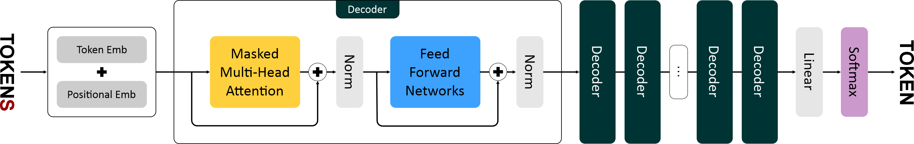

### Структура проекта

```
src
└── model
    ├── core
    │   └── attention.py
    │   └── feedforward.py
    │   └── positional_encoding.py
    ├── layers
    │   ├── decoder.py
    │   └── embeddings.py
    └── gpt.py
```

### Функционал

*attention.py*
- Multi Head архитектура внимания

*feedforward.py*
- Полносвязная сеть (FFN) с активацией ReLU

*positional_encoding.py*
- Обучаемое позиционное кодирование

*decoder.py*
- Блок декодера
- post-layer нормализация
- Остаточная связь (residual connection)
- FFN

*embeddings.py*
- Отображение из пространства словаря модели

*gpt.py*
- Логика обработки исходной последовательности моделью
- Генерация токенов: возможность применения top-k и top-p стратегий, контроля температуры
- Базовые процедуры обучения, сохранения и загрузки модели

