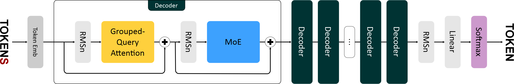

### Структура проекта

```
src
└── model
    ├── core
    │   ├── attention.py
    │   └── mixture_of_experts.py
    │   └── normalization.py
    │   └── positional_encoding.py
    ├── layers
    │   ├── decoder.py
    │   └── embeddings.py
    └── mixtral.py
```

### Функционал

*attention.py*
- Grouped Query архитектура внимания
- Возможность ограничения длины контекста (sliding window attention)
- Возможность использования KV-кэширования

*mixture_of_experts.py*
- Функция активации SiLU
- Слой активации SwiGLU
- Отбор top-k экспертов и вычисление их весов для каждого токена
- Распределение обрабатываемых токенов по релевантным экспертам

*normalization.py*
- Root Mean Square нормализация 

*positional_encoding.py*
- Роторное позиционное кодирование (RoPE)

*decoder.py*
- Блок декодера
- pre-layer нормализация
- Остаточная связь (residual connection)
- MoE вместо простой полносвязной сети (FFN)

*embeddings.py*
- Отображение из пространства словаря модели

*mixtral.py*
- Логика обработки исходной последовательности моделью
- Генерация токенов: возможность применения top-k и top-p стратегий, контроля температуры
- Базовые процедуры обучения, сохранения и загрузки модели

